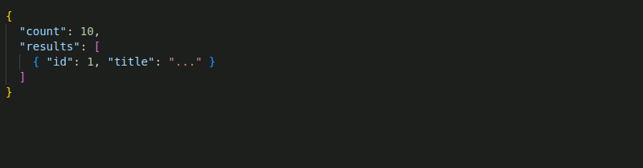
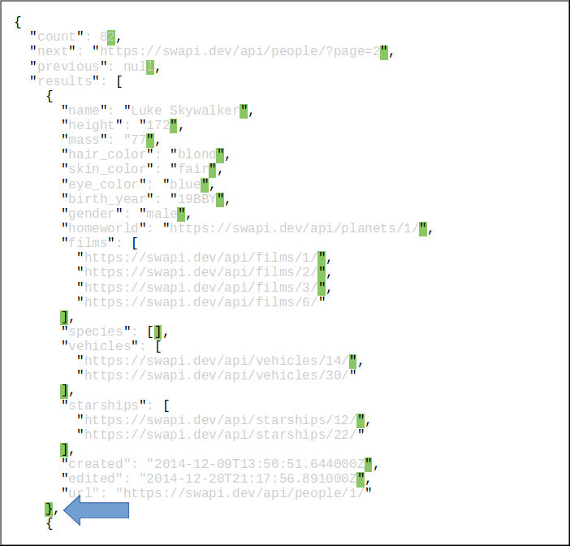
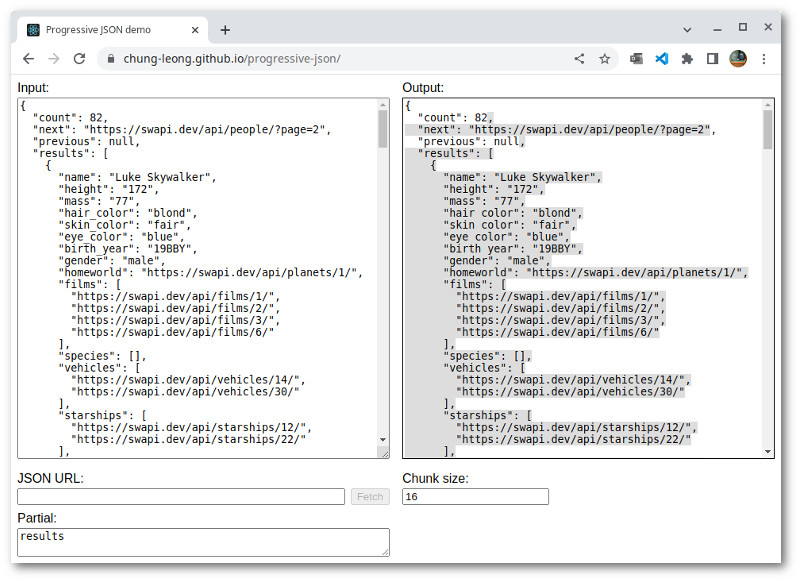
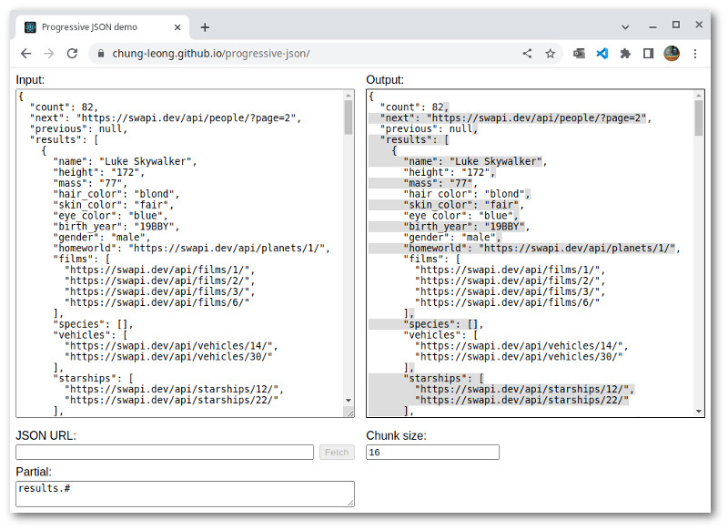

# Progressive-json  

A Javascript library that processes JSON data progressively. Instead of making you wait until
the file transfer has completed, it provides you with continual snapshots of the  object as
data arrives from the remote server: 

Progressive retrieval helps improve preceived load time. This library also lets you download a
JSON file incrementally using 
[HTTP range requests](https://developer.mozilla.org/en-US/docs/Web/HTTP/Range_requests), 
making it practical to host data-driven app on static website providers like 
[GitHub Pages](https://pages.github.com/). 

## Feature set

* An async generator function for retrieving snapshots of JSON objects: [fetchJSON](./doc/fetchJSON.md)
* React hooks for make use of progressively loaded JSON: [useProgressiveJSON](./doc/useProgressiveJSON.md) and [usePartialJSON](./doc/usePartialJSON.md)
* A server-side function for streaming of large JSON objects: [createJSONStream](./doc/createJSONStream.md)

## How it works

Progress-JSON does not actually perform any JSON parsing on its own. All it does is monitoring the byte stream for certain characters:

Shown in black are these special characters: right and left curlies, right and left brackets, comma, double quotation mark, and backslash. Shown with a green background are the locations where the JSON structure can be safely cleaved: immediately before a comma and immediately after a curly or square bracket.

Supposed we want to stop parsing after the first item in `results`. We want to cleave the structure at the spot indicated by the arrow. To make the fragment syntactically correct, we just need to append `] }`. We know that because we've been monitoring the appearances of different brackets. To make the next fragment syntactically correctly, we need to prepend it with `{ "": [`. 

Actual JSON parsing is done by 
[`JSON.parse()`](https://developer.mozilla.org/en-US/docs/Web/JavaScript/Reference/Global_Objects/JSON/parse). 

## Partial JSON Demonstration

Progressive-json does not make use of every possible cleave points. Only objects specified by you
through the `partial` option will show up partially complete. The 
[project demo site](https://chung-leong.github.io/progressive-json/) shows you how this is done:

Initially, `partial` is set to "results". That means the root level object and object.results can be 
partial. If you change `partial` to "results.#", you'll see the following:

Now items inside the array can be partial too (# in the object path indicates array item). If we want 
the list of films in the character object to be partial, we would specify "results.#.films". If we 
want all the lists to be partial, we would specify "results.#.*".

The chunk size is set to a unrealistic small size of 16 for demonstration purpose. Make it bigger (5K ~ 10K) to get a better sense of how an object would be divided in actual usage. 

## Examples

* [USDA dood data example](./tree/main/examples/food-data) - A website using data from a large static JSON file
* [WordPress example](./tree/main/examples/wordpress) - Streaming JSON from a MySQL database

## API reference

#### Client-side:

* [fetchJSON](./doc/fetchJSON.md)
* [generateJSON](./doc/generateJSON.md)
* [getJSONProgress](./doc/getJSONProgress.md)
* [useArraySlice](./doc/useArraySlice.md)
* [usePartialJSON](./doc/usePartialJSON.md)
* [useProgressiveJSON](./doc/useProgressiveJSON.md)

#### Server-side:

Server-side functions are found in `"progressive-json/server"'.

* [createJSONStream](./doc/createJSONStream.md)
* [countGenerated](./doc/countGenerated.md)
* [deferred](./doc/deferred.md)

