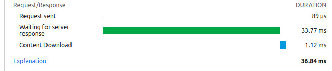

# WordPress database example

This example demonstrates the use of [`createJSONStream`](../../doc/createJSONStream.md) on 
the server-side. We'll examine how streaming a JSON object can help improve response time.
As a test database, we'll use site data from an instance of WordPress running alongside 
MySQL (MariaDB, actually) in Docker.

## Seeing the code in action

Follow these steps if you wish to see the code running on your own computer:

1. Run `git clone https://github.com/chung-leong/progressive-json.git`
2. Run `cd progressive-json/examples/wordpress; npm ci; npm run build`
3. Run `cd server; docker-compose up -d`
4. Open browser, go to `http://172.129.0.5` and finish WordPress set-up
5. In WordPress admin, install the FakerPress plugin.
6. Use FakerPress to create test users, tags, and posts.
7. Run `node index.mjs`  
8. Go to `http://localhost:8080/`

## The server script

The [test server](./server/index.mjs) is initiated using an IIAFE. A MySQL connection pool 
is the first thing we create:  

```js
(async () => {
  // create MySQL connection pool
  const pool = createPool({
    host: '172.129.0.4',
    user: 'wordpress',
    password: 'wordpress',
    database: 'wordpress',
    waitForConnections: true,
    connectionLimit: 10,
  });  
```

Then we set up [Fastify](https://www.fastify.io/), along with some useful 
plugins:

```js
  const fastify = Fastify({ ignoreTrailingSlash: true, trustProxy: true });
  // use cache control
  await fastify.register(Caching, { privacy: 'public', expiresIn: 5 });
  // allow CORS
  await fastify.register(CORS, { origin: true });
  // serve static files
  await fastify.register(Static, { root: buildPath });
```

We register a route for retrieving posts:

```js
  // register routes
  fastify.get('/api/posts', async (req, reply) => {
    const page = parseInt(req.query.page ?? '1');
    const perPage = parseInt(req.query.per_page ?? '10');
    const posts = loadPosts(pool, page, perPage);
    return createJSONStream(posts);
  });
```

Here's where `createJSONStream` gets called. Fastify allows us to simply return the stream. With 
the more archaic Express.js we'd need to do `createJSONStream(posts).pipe(res)`.

We register a second, alternative route that does things differently:

```js
  fastify.get('/api-alt/posts', async (req, reply) => {
    const page = parseInt(req.query.page ?? '1');
    const perPage = parseInt(req.query.per_page ?? '10');
    const posts = loadPosts(pool, page, perPage);
    let list = [];
    for await (const post of posts ){
      list.push(post);
    }
    return list;
  });
```

Finally the server starts listening for requests:

```js
  // start listening for requests
  await fastify.listen({ host: 'localhost', port: 8080 });
})();
```

## The loadPosts function

[loadPosts](./server/index.js#L49) is an async generator function. The first thing 
that it does is create a helper function bound to the database connection:

```js
async function* loadPosts(connection, page, perPage) {
  const mysql = query(connection);
```

Then it queries for the matching posts, retrieving just the post ids and author ids:

```js
  const [ postIds, authorIds ] = await mysql.columns`
    SELECT ID, post_author 
    FROM wp_posts 
    WHERE post_type = 'post'
    ORDER BY post_date DESC 
    LIMIT ${perPage} OFFSET ${(page - 1) * perPage}
  `;
```

With the author ids, it loads the author records:

```js
  const authors = await mysql.all`
    SELECT ID, display_name, user_nicename, user_url 
    FROM wp_users 
    WHERE ID IN (${authorIds})
  `;
```

Then it loads the tag and category records:

```js
  const termRelationships = await mysql.all`
    SELECT term_taxonomy_id, object_id
    FROM wp_term_relationships 
    WHERE object_id IN (${postIds})
    ORDER BY term_order
  `;
  const terms = await mysql.all`
    SELECT term_taxonomy_id, name, slug, taxonomy 
    FROM wp_term_taxonomy TT INNER JOIN wp_terms T ON T.term_id = TT.term_id
    WHERE term_taxonomy_id IN (${termRelationships.map(r => r.term_taxonomy_id)})
  `;
```

Finally, it queries for the content of the posts, using the ids obtained earlier:

```js
  const posts = mysql`
    SELECT ID, post_title, post_date_gtm, post_content, post_author,  
    FROM wp_posts
    WHERE ID IN (${postIds})
    ORDER BY FIELD(ID, ${postIds})
  `;
```

Unlike `mysql.columns` and `mysql.all`, which return promises, `mysql` proper returns 
an object stream yielding rows as they're fetched from the database. It's 
async-iterable like all Node streams. We iterate through it to attach information from 
the author, tag, and category records we had obtained earlier:

```js
  for await (const post of posts) {
    const postAuthor = authors.find(a => a.ID == post.post_author);
    const postRelationships = termRelationships.filter(r => r.object_id === post.ID);
    const postTermTaxIds = postRelationships.map(r => r.term_taxonomy_id);
    const postTerms = terms.filter(t => postTermTaxIds.includes(t.term_taxonomy_id));
    const postTags = postTerms.filter(t => t.taxonomy === 'post_tag');
    const postCategories = postTerms.filter(t => t.taxonomy === 'category');
    yield {
      id: post.ID,
      title: post.post_title,
      date: post.post_date_gtm,
      content: post.post_content,
      author: {
        name: postAuthor?.display_name,
        nicename: postAuthor?.user_nicename,
        url: postAuthor?.user_url,
      },
      categories: postCategories.map(({ name, slug }) => {
        return { name, slug };
      }),
      tags: postTags.map(({ name, slug }) => {
        return { name, slug };
      }),
    };
  } 
}
```

## Initial results

Chrome's development console shows promising results. From the `/api/posts` endpoint the 
browser begins receiving data almost immediately:


It compares very well with our load-everything-first endpoint:



Right off the bat `createJSONStream` is able to send the open bracket of the JSON array. 
Obviously, a single bracket wouldn't help us much. What we want to know is at what 
point we receive usable data. We need to measure that in frontend code.

## Frontend tests

Our [test component](./src/App.js#L19) is very simple. It calls 
[`useProgressiveJSON`](./doc/useProgressiveJSON.md) to initiate the transfer:

```js
  const items = useProgressiveJSON(running && url, { delay: 0 });
```

Then we note the time when we receive the first and the last items in a useEffect hook:  

```js
  useEffect(() => {
    if (running) {
      const now = new Date();
      if (!startTime) {
        setStartTime(now);
      } else if (!timeToFirst && items.length > 0) {
        setTimeToFirst(`${now - startTime} ms`);
      } else {
        const { done } = getJSONProgress(items);
        if (done) {
          setTimeToLast(`${now - startTime} ms`);
        }
      }
    }
  }, [ items, running, startTime, timeToFirst ]);
```

Before each test we need to manually restart MySQL and clear the disk cache. We will also enable 
bandwidth throttling to make the tests somewhat more realistic. The results shown below involved 
a 10mbit connection with 40ms latency.

For the first test we set `per_page` to 10, a typical default value. As you can see, we're getting no improvement at all:


The amount of data is just too small. We start to see an improvement when we bring the number of posts up to 50:


The advantage grows as the number of posts increases:


The second time is what the response time would be if we 
load the data using `Response.json`. For 250 posts, it's 
well beyond acceptable:


Thanks to Progressive-JSON, our first-content time remains 
tolerable even when we don't use streaming on the server 
side: 


The overhead from loading everything first starts to get 
too much when `per_page` is 1000: 


It becomes too much when `per_page` is 2000:


At this point, the amount of data is over 8 meg, pretty excessive for the purpose of 
preloading content.

## Conclusion

This library is designed to let you preload extra data without paying a penalty in terms 
of first-content time. It does a decent job in most cases even when no modifications was made 
on the server-side. Implementing streaming does improve things a bit. For database queries 
that require more time (full-text search, for instance), the improvement to response time 
could potentially be significantly larger than shown by this example. Streaming also 
reduces memory usage, helping your site scale a bit better.
